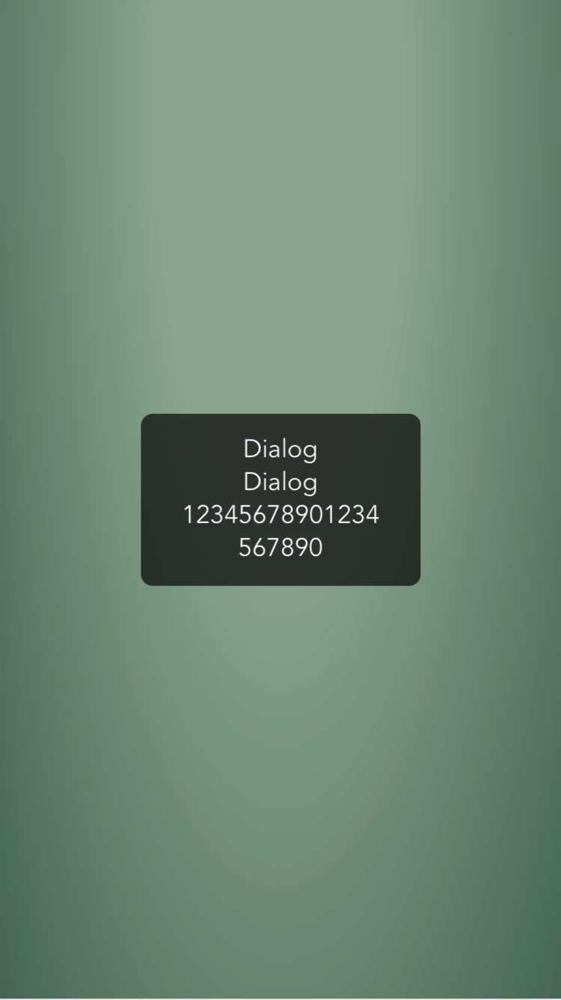
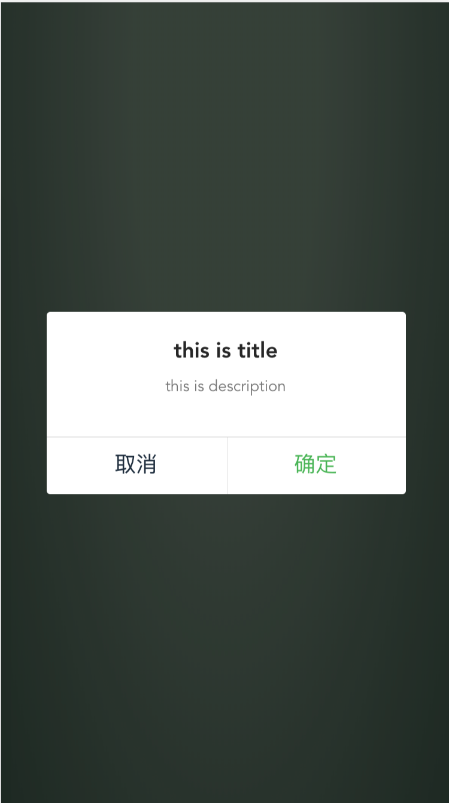
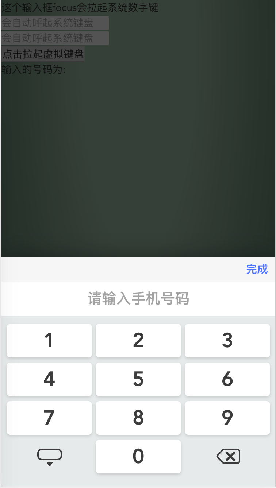
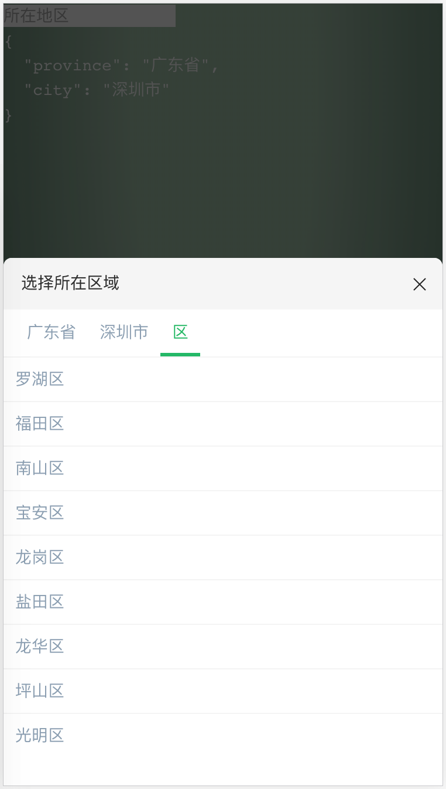

## Additional functions

- imagemin plugin
- CSS reset & rem
- Animation Less library
- vConsole

# CSS reset & rem 方案

具体作用原因是因为`src/style/base/import.reset.less`设置了(初始化)

```less
html {
  font-size: 100px;
}
```

这样 1rem 就变成 100px 了。结合`src/style/base/import.variables.less`的`@rem: 200rem;`就可以得出这样一个公式

```
width: 750 / @rem
=> width: 750 / 200rem
=> width 750/200*100px
=> width: 375px
```

我们书写数值的时候，如测量设计稿宽度为 750x，那么就写`width: 750 / @rem`, 不需要再去换算。

同理，如果实际元素大小为 375px，则应该写 750/@rem

其次，`rem.js`脚本会计算 html 标签的 font-size 动态改变这个值使屏幕宽度一直为`750/@rem`。
具体实现为: html 的`font-size`为 document.documentElement.clientWidth / 375，最大为 200。

# vConsole

vconsole 比 eruda 小，是微信团队推出的移动端调试工具，框架封装了这块，可以在链接上加上`debug=vconsole`或者`vconsole=true`开启调试模式。console.log 会在这里显示

# 命名规范

## 组件命名规范

组件命名需要以大驼峰形式，name 以连字符形式

```js
Vue.component('todo-item', {
  // ...
})
export default {
  name: 'TodoItem'
  // ...
}
```

# 组件列表

- [x]数字键盘（需要有数字按键）
  - [x]长按删除键清除全部文本
- [x]地区级联组件开发
  - [x]支持锁定 1 级地区
- [x]基本弹窗提示 alert 组件
- [x]左右按钮 confirm 组件（单双按钮点击）
- [x]滚动返回顶部组件
  - [ ]支持拖拽
  - [x]支持超过页面多少高度后显示/滚动超过多少隐藏
- [x]轮播图无限滚动
- [ ]分享
- [x]验证码虚拟键盘
- [x]身份证虚拟键盘

## 截图








